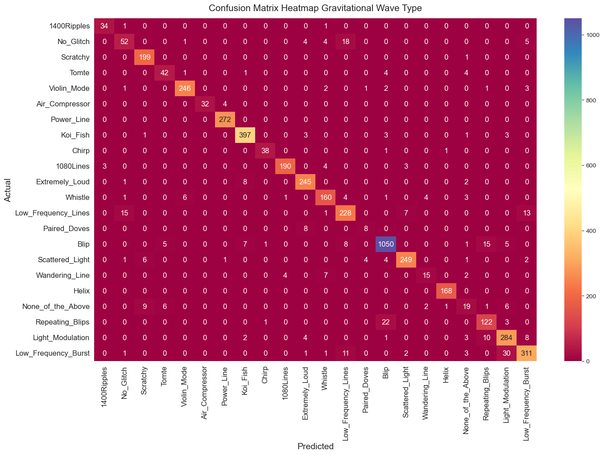
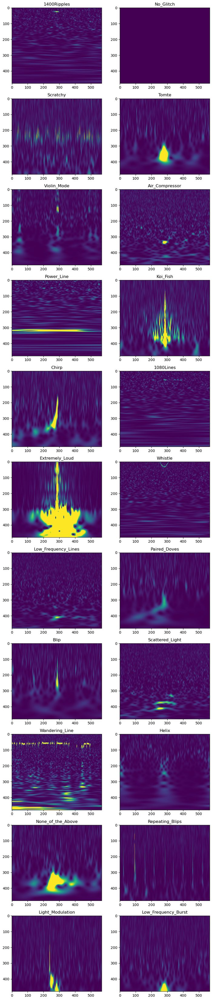
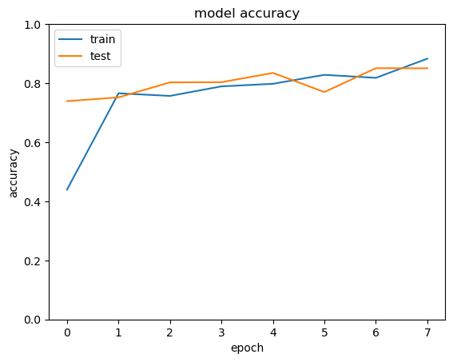
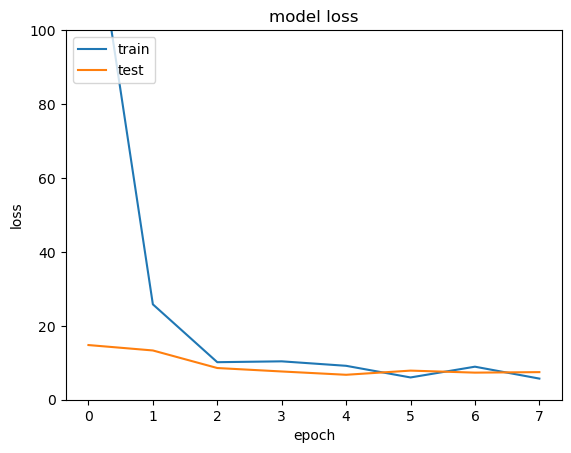

# Classifying LIGO Detector Glitches with a CNN

A convolutional neural network that sorts gravitational-wave detector noise artifacts into 22 morphological classes from spectrogram images. **92.4% accuracy on a held-out test set of 4,720 images.**

Built during *Machine Learning for Physics and Astronomy* at Brown University (Summer 2025).

<p align="center">
  
</p>

---

## The problem

LIGO's interferometers can measure a change in length thousands of times smaller than a proton. That sensitivity is what makes detecting gravitational waves possible — and it is also why the instrument picks up a constant stream of non-astrophysical noise from seismic activity, power lines, scattered laser light, and the hardware itself.

These transient artifacts are called **glitches**. They matter because they can mimic or bury a real signal. The [Gravity Spy project](https://www.zooniverse.org/projects/zooniverse/gravity-spy) tackles this by sorting glitches into named morphological families — `Blip`, `Koi_Fish`, `Scattered_Light`, `Whistle`, `Violin_Mode` and others — so detector scientists can trace each family back to a physical cause and fix it.

Because each glitch is rendered as a time–frequency spectrogram, glitch classification becomes an image classification problem. That is what this project solves.

## Data

The [Gravity Spy dataset](https://www.kaggle.com/datasets/tentotheminus9/gravity-spy-gravitational-waves) contains labeled spectrograms hand-verified by citizen scientists and the LIGO Detector Characterization team ([Bahaadini et al., 2018](https://inspirehep.net/literature/1843080)).

| Split | Images |
|---|---|
| Train | 22,348 |
| Validation | 4,800 |
| Test | 4,720 |
| **Classes** | **22** |

The 22 classes cover LIGO's first and second observing runs, and include two catch-all labels — `No_Glitch` and `None_of_the_Above` ([Zenodo data release](https://zenodo.org/records/5649212)).

<p align="center">
  
</p>

Classes are heavily imbalanced. `Blip` accounts for roughly 1,100 of the 4,720 test images, while `Paired_Doves` and `Wandering_Line` have fewer than 20 each. This turns out to drive most of the model's remaining errors.

## Approach

**Preprocessing.** Images are rescaled to `[0, 1]` and then standardized *per sample* — each image is centered and divided by its own standard deviation. This is the design decision I would defend hardest: glitch spectrograms vary enormously in overall brightness depending on how loud the noise event was, and per-sample normalization forces the network to key on morphology rather than raw intensity. Inputs are resized to 300×300.

**Architecture.** A deliberately small CNN, ~1.06M trainable parameters:

```
Conv2D(128, 3×3, stride 2, tanh)  →  MaxPool(2×2)
Conv2D(128, 3×3, stride 2, tanh)  →  MaxPool(2×2)
Flatten                           →  Dense(22, softmax)
```

Strided convolutions handle most of the downsampling, which keeps the model small enough to train without a dedicated GPU.

**Training.** Adam, categorical cross-entropy, up to 20 epochs, with `EarlyStopping` on validation loss (patience 3) and `ReduceLROnPlateau` (factor 0.1, patience 2). The learning rate drops at epoch 7 and early stopping ends the run before the full 20 epochs.

## Results

| Metric | Value |
|---|---|
| **Test accuracy (held out, 4,720 images)** | **92.39%** |
| Final validation accuracy | 92.25% |
| Final training accuracy | 98.44% |

<p align="center">
  
  
</p>

For context, published ensemble models on this dataset reach roughly 98% ([Bahaadini et al.](https://inspirehep.net/literature/1843080)), so a two-layer CNN landing at 92% is a reasonable showing for a compact architecture.

### Where the model actually fails

The headline number is less interesting than the confusion matrix. Errors are not spread evenly — they cluster in three specific, explainable places:

**1. The catch-all classes are the weakest by far.** `None_of_the_Above` is correctly identified only 19 times, with its errors scattered across nearly every other class. This is expected and arguably not a modeling failure: the class has no consistent morphology to learn, since it is defined by *not* fitting anywhere else. `No_Glitch` performs poorly too, with 18 of its images predicted as `Low_Frequency_Lines`.

**2. Genuinely similar morphologies get confused.** 22 `Repeating_Blips` images are predicted as `Blip` — which is the confusion a human would also make, since a repeating blip is literally several blips. Similarly, 30 `Low_Frequency_Burst` images are predicted as `Light_Modulation`.

**3. Rare classes suffer.** `Paired_Doves` gets 8 of 16 correct. With so few training examples and a majority class ~70× larger, the model has little incentive to learn them.

Well-separated classes with distinctive textures do very well: `Scratchy` (199/200), `Koi_Fish` (397 correct), `Power_Line` (272), `Helix` (168).

### Limitations

Stating these plainly, because they are the honest read of the result:

- **The train/validation gap is real.** 98.4% training vs. 92.3% validation indicates overfitting. There is no dropout, batch normalization, or data augmentation in this model.
- **No class weighting.** Given the severity of the imbalance, weighted loss or oversampling of rare classes would likely be the single highest-value change.
- **Accuracy is a flattering metric here.** With `Blip` making up roughly a quarter of the test set, per-class recall and macro-F1 would describe performance more honestly than overall accuracy.
- **The initial learning rate (0.01) was aggressive**, producing very large early-epoch losses before the plateau callback corrected it.

### What I would do next

1. Add class weights or resampling, and report macro-F1 alongside accuracy.
2. Add dropout and light augmentation (small time-axis shifts — vertical flips would be physically meaningless on a spectrogram).
3. Swap `tanh` for `ReLU` and add batch normalization.
4. Fine-tune a pretrained backbone such as ResNet-50; published work reports large gains from transfer learning on this dataset ([Deep Learning for Physical Sciences, NeurIPS 2017](https://dl4physicalsciences.github.io/files/nips_dlps_2017_25.pdf)).
5. Merge or drop `None_of_the_Above` and re-evaluate, to separate "the model is wrong" from "the label is undefined."

## Running it

```bash
git clone https://github.com/<your-username>/gravity-spy-cnn.git
cd gravity-spy-cnn
pip install -r requirements.txt
jupyter notebook notebooks/gravity_spy_cnn.ipynb
```

Download the dataset from [Kaggle](https://www.kaggle.com/datasets/tentotheminus9/gravity-spy-gravitational-waves) and unpack it so the layout is:

```
archive/
├── train/train/<class_name>/*.png
├── validation/validation/<class_name>/*.png
└── test/test/<class_name>/*.png
```

The dataset is not included in this repository. Training takes a few hours on CPU.

## Repository layout

```
├── notebooks/
│   └── gravity_spy_cnn.ipynb    # full pipeline, outputs preserved
├── assets/                      # figures used in this README
├── requirements.txt
└── README.md
```

## References

- Bahaadini et al., *Machine learning for Gravity Spy: Glitch classification and dataset*, Information Sciences (2018) — [INSPIRE-HEP](https://inspirehep.net/literature/1843080)
- Glanzer et al., *Data quality up to the third observing run of Advanced LIGO: Gravity Spy glitch classifications*, Class. Quantum Grav. (2023) — [IOPscience](https://iopscience.iop.org/article/10.1088/1361-6382/acb633)
- Gravity Spy classification data release — [Zenodo](https://zenodo.org/records/5649212)
- George, Shen & Huerta, *Glitch Classification and Clustering for LIGO* — [NeurIPS DLPS 2017](https://dl4physicalsciences.github.io/files/nips_dlps_2017_25.pdf)

---

**Minjae Kim** · Data Science, UC Berkeley '30 · [LinkedIn](https://linkedin.com/in/your-handle)
